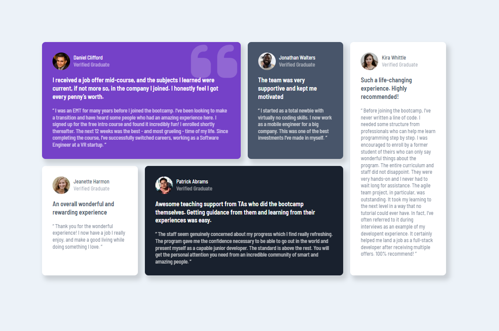

# Four card feature section

`Thank you for visiting my code` 👋

## Design on Desktop

## Design on Mobile

.png>)

### Used tools

- HTML
- SASS

#### Project Structure

- app
  - images
  - sass
    - abstract
      - \_breakpoint.scss
      - \_functions.scss
      - \_mixins.scss
      - \_variables.scss
      - \_index.scss
    - base
      - \_boilerpoint.scss
      - \_colors.scss
      - \_fonts.scss
      - \_typography.scss
      - \_index.scss
    - components
      - \_info.scss
      - \_testimonial.scss
      - \_index.scss
    - layout
      - \_testimonials.scss
      - \_index.scss
    - main.scss
- dist
  - main.css
  - main.css.map
- index.html

 **This challenge from [frontendmentor](https://www.frontendmentor.io/)**

`Stay save and Goodbye` 👋
